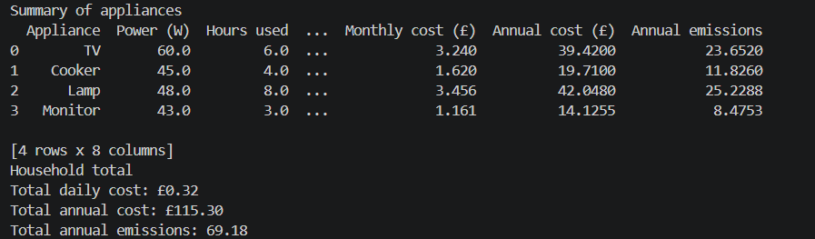
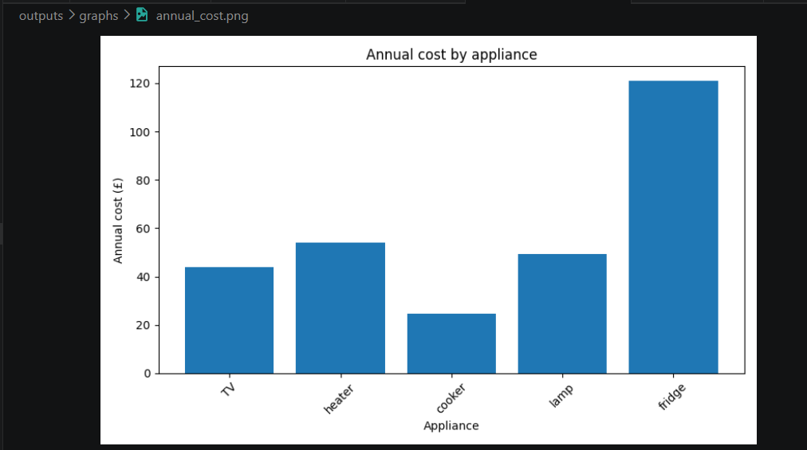
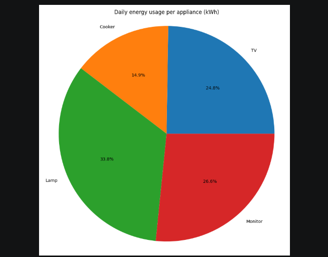

# UK Household Energy Monitor:

## Features:

- Calculates daily, monthly and annual electricity costs
- Calculates annual CO₂ emissions
- Supports multiple appliances
- Exports results to CSV
- Generates data visualisations

---

### Example console output:

---

## Example Graphs:

### Annual Cost by Appliance

### Daily Energy Usage

